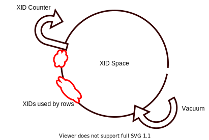

PostgresSQL provides a concurrency read/write model, simply described as "rows created *in the future* or deleted *in the past* are invisible to current transcation".

To determine whether a row is *in the future* or *in the past* of a trascation, Postgres assigns an incrementing 32-bits interger, **transcation ID** (XID), to each trancation.
For instance, a row created by a transcation has a `XMIN` value equals to XID of the transcation, indicating this row is visible only to transcations in the future of `XMIN`.

## First look of wrap-around

Given a transcation with `XID` and a row with `XMIN`, let's say we use a simple algorithm to determine the visibility:
```C
bool isVisible(unsigned int XID, unsigned int XMIN){
  return XID > XMIN;
}
```

We construct a linear XID space. But an obvious problem is that the number of transcations might be beyond the scope of 32-bits interger.
Once the XID increases up to the limit of 32-bits, it wraps around to zero. Then all the rows actually in the past appear to be in the future.
This is so-called **wrap-around** failure.

## Vacuuming XIDs

To avoid wrap-around failure, we can *freeze* the rows which are *old enough*.
Let's say there is a row with `XMIN`, and all the transcations begin in the past are completed.
Then `XMIN` field is unnecessary since any active transcation is in the future of it.
So we can mark this row as *frozen* and reuse the XID. The process of freezing rows and reusing XID is called `VACUUM`.

The word *vacuum* is quite interesting. Consider XID counter is going through the XIDs space and leaving some used XIDs along the way, while a vacuum cleaner is following and cleaning the space.


With the linear XID space, XID counter returns to the beginning of XID space once the wrap-around occurs.
However it must be blocked until all XIDs are vacuumed. This could become a bottleneck of database.

## Modulo XID space
In real world, Postgres actually uses a modulo 2^32 arithmetic XID space, where the visibility algorithm can be briefly described as:
```C
bool isVisible(unsigned int XID, unsigned int XMIN){
  return  XID - XMIN < 2^31;
}
```

We can think of XIDs space as a circle. Given a XID, there are 2^31 XIDs (a half of the space) greater than it.

With modulo XID space, Postgres just need to promise that, whenever a transcation begins, the greater half of the space is vacuumed.



Consider if we do vacuum so aggressive that the XID space is always almost clean up, the XID counter will never be blocked!

## auto_vacuum

Postgres provides an `auto_vacuum` daemon to do vacuum. By setting the parameters, database managers can control the behaviour of this deamon to satisfy the requirement of their specific domains. However inappropriate parameters might cause the loss of performance, even the database failure. Here are two of the most useful parameters:

> `vacuum_freeze_min_age` controls how old an XID value has to be before rows bearing that XID will be frozen. Increasing this setting may avoid unnecessary work if the rows that would otherwise be frozen will soon be modified again, but decreasing this setting increases the number of transactions that can elapse before the table must be vacuumed again.

> `autovacuum_freeze_max_age` implies that if a table is not otherwise vacuumed, autovacuum will be invoked on it approximately once every `autovacuum_freeze_max_age` minus `vacuum_freeze_min_age` transactions.

A principle is, the more frequently we schedule vacuum, the less effect (time and space) one vacuum takes. [Postgres document](https://www.postgresql.org/docs/current/routine-vacuuming.html#VACUUM-FOR-WRAPAROUND) provides a complete description of all the parameters.
