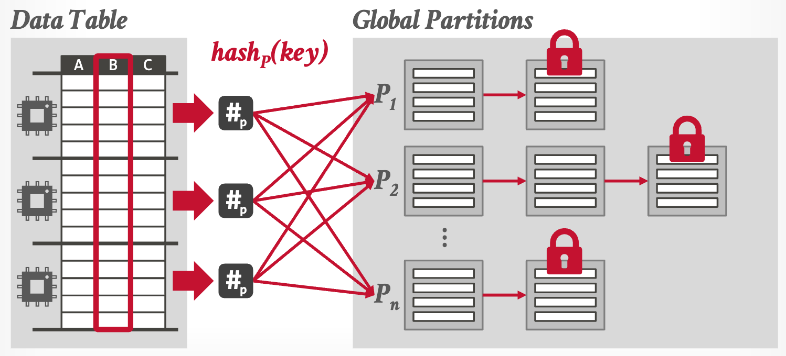
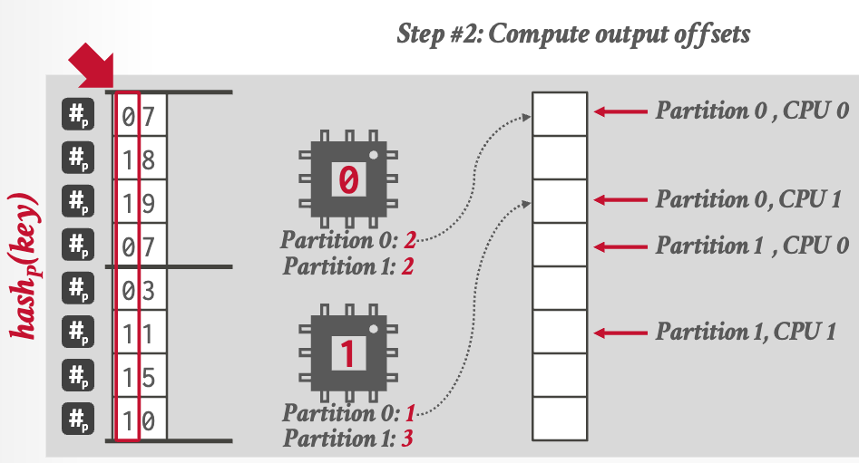
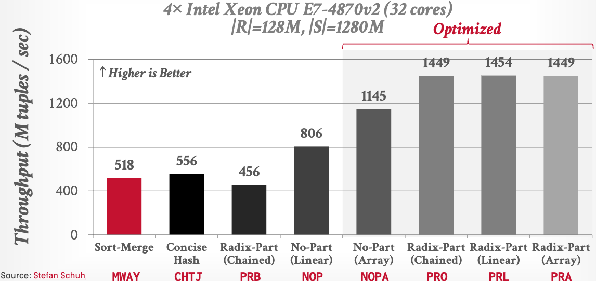
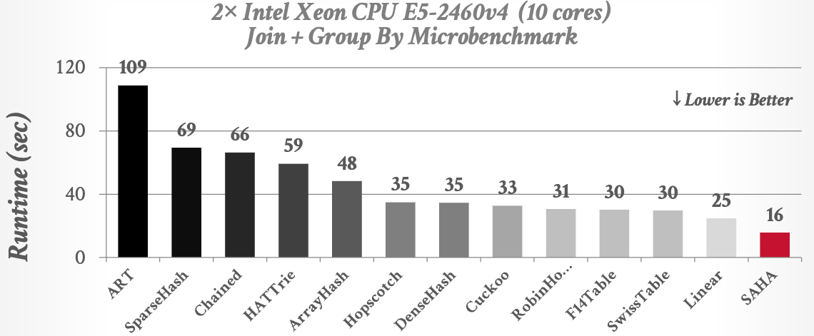

## _Lecture Note_ 09. Hash Join Algorithms

Hash join is the most or one of the most important operator(s) in OLAP DBMS, although not the dominant cost. This lecture focus almost on hash join (partitioned vs non-partitioned), since (1) nested-loop join is always the worst for OLAP and (2) sort-merge join is slower the most of time.

The design goals of hash join on modern hardware are (1) minimize synchronization between threads or cores and (2)
minimize memory access cost, especially for remote NUMA access.

### Hash Join Phase #1: Partition (optional)

#### Approach #1: Non-Blocking Partitioning

- Shared Partitions
  
- Private Partitions
  

#### Approach #2: Blocking Partitioning (Radix Hash Join)

1. 
1. 
1. 

Optimizations:

- Software Write Combine Buffers
- Non-temporal Streaming Writes

### Hash Join Phase #2: Build

Hash tables design decisions:

1. Hash Function: CRC32, CRC64, xxHash, ...
1. Hashing Scheme: Chained / Linear / Robin Hood Hashing / Hopscotch Hashing / Cuckoo Hashing

Hash table content trade-offs:

- Tuple Data vs. Pointers/Offsets to Data
- Join Keys-only vs. Join Keys + Hashes

### Hash Join Phase #3: Probe

Use bloom filter (as we did everywhere).

### Benchmarks

- Non-partition + linear is generally good.
  
- Join operator is not the dominant cost.
  
- Linear probe is good, at least for string hash tables.
  
