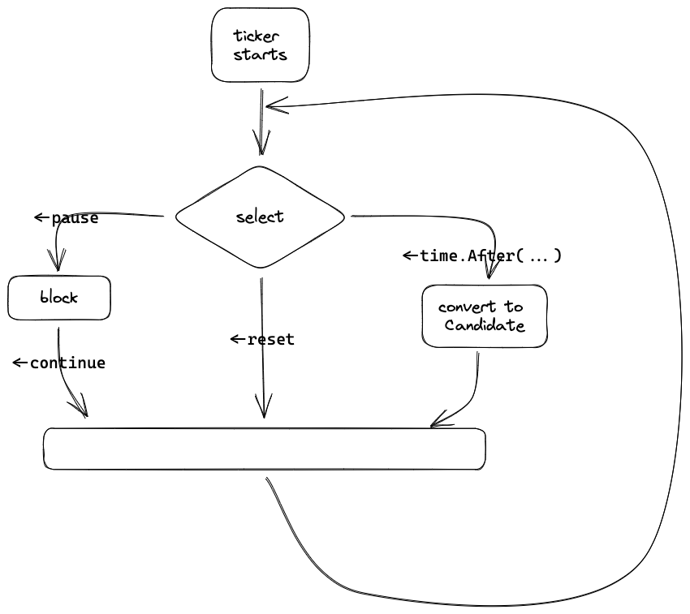

I'm learning [MIT 6.824: Distributed Systems](https://pdos.csail.mit.edu/6.824/) recently. This post is my solution to [lab 2](https://pdos.csail.mit.edu/6.824/labs/lab-raft.html). This lab requires to implement a Raft system.

## Part 2A: leader election

- Election ticker and heartbeat ticker

  For simplity, each Raft server starts two goroutines, responsing for timeout elections and heartbeats respectively. The Raft server controls its behavior via channels.

  For example, the election ticker has 3 channels: `reset`, `pause` and `continue`. It loops to select a random timeout, `reset` signal or `pause` signal. For (1)timeout, it converts to candidate (which starts a election); for (2)`reset`, it restarts a loop; for (3)`pause`, it blocks to wait for another signal from `continue`.

  

  The heartbeat ticker is almost the same, except it has no `reset` channel.

- `convertTo`

  A difficulty of this part is how to handle states switching. I define a helper function `func (rf *Raft) convertTo(s State)`.

  > To enum all possible `(oldState, newState)` pairs, I use a trick here: `State` type is defined as `int` and each state has a unique bit.
  >
  > ```go
  > type State int
  > const (
  > 	Follower State = 1 << iota /* 0x1 */
  > 	Candidate                  /* 0x2 */
  > 	Leader                     /* 0x4 */
  > 	__nState = iota            /* 3 */
  > )
  > ```
  >
  > So that each pair has a unique integer and thus can be used in `switch-case`.
  >
  > ```go
  > func (s State) to(t State) int { return int(s | t<<__nState) }
  >
  > switch oldState.to(newState) {
  > case Follower.to(Candidate): /* ... */
  > case Candidate.to(Candidate): /* ... */
  > /* ... */
  > }
  > ```

  In Figure 4 of the paper, 5 edges are defined. For convinience, I add `Follower->Follower` to deal with election timer reset.

  

- Election, `RequestVote` RPC

  To do an election, `sendRequestVote` to peers and wait for reply. In case some connections are too slow to reply in a timeout, election goroutine should not wait for all peers replying. Instead, when a peer reply, `atomic.Add` the number of votes, if it just reaches the majority, call the `convertTo(Follower)`.

- Heartbeat, i.e. empty `AppendEntries` RPC
