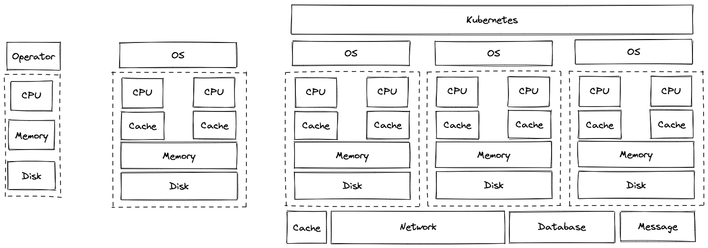

## The History

### Operators to Operating Systems

For those early computers, it is human operators that put the jobs on the machine one by one and returned the output to the users. These procedures are known as jobs scheduling today, but back then they did it *manually*.

These manual procedures were soon automated in the late 1950s. There came the first operating systems. From then on, engineers wanted to automate other aspects of computing. So the functionality of OS expanded to resource allocation, user interaction, etc.

|||
|--|--|
|1950–1960|Batch systems|
|1960–1975|Interactive systems|
|1975–2005|Desktop systems|
|2005 onward|Cloud-mobile systems|

### OS Principles

By 1965, engineers yielded a set of eight principles of OS:

- Interactive computing (time-sharing)
- Hierarchical file systems
- Fault tolerant structures
- Interrupt systems
- Automated overlays (virtual memory)
- Multiprogramming
- Modular programming
- Controlled information sharing

These principles had an influence on later Unix, Minux and Linux.

Engineers had also learned other principles that led to reliable and dependable OS. The SOSP institutionalized these principles. And later these principles were proved to be general in other fields of CS.

### OS is Both Academia and Industry

> Both the researcher and the professional seek answers to questions. The one aims to push the frontier of knowledge, the other to make a system more valuable to a customer.

## The Future -- Cloud Operating Systems

Nowadays, computer clustering has become the de facto standard for servers. As they did fifty years ago, engineers want to automate the procedures of operating these clusters. So there comes Kubernetes.

*Is Kubernetes an OS? Yes!*

Kubernetes has most characteristics of an OS.

|Linux|Kubernetes|
|:-:|:-:|
|Process|Pod|
|Thread|Container|
|Socket|Network|
|File|Resource|
|Disk|Storage|
|...|...|

- Pods are scheduled to computer nodes.
- Pods share the physical resources (cpu, memory, disk, network).
- Pods are isolated with each other, so that faults will not spread.
- Pods can connect to each other via Kubernetes network.
- ...

The main difference between Kubernetes and other OS is that OS runs *directly on the metal* but Kubernetes runs on the actual OS. More precisely, Kubernetes is a cloud operating system rather than an OS. It abstracts computing resources over functionality provided by the actual OS. That is to say, Kubernetes does not replace Linux because it runs on Linux, at least for now.

Will Kubernetes become a real OS? For many servers, Kubernetes is almost the only application that runs on the actual OS. That is to say, some functionality of OS maybe unnecessary.
