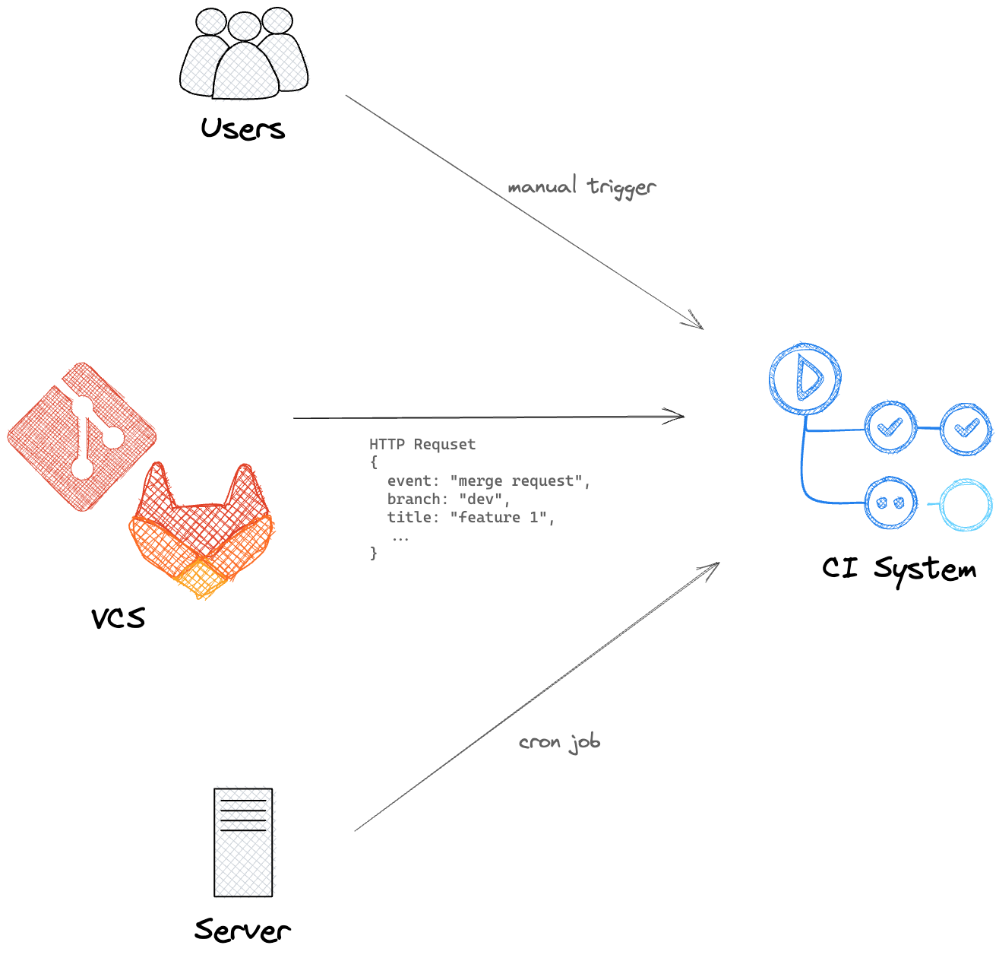
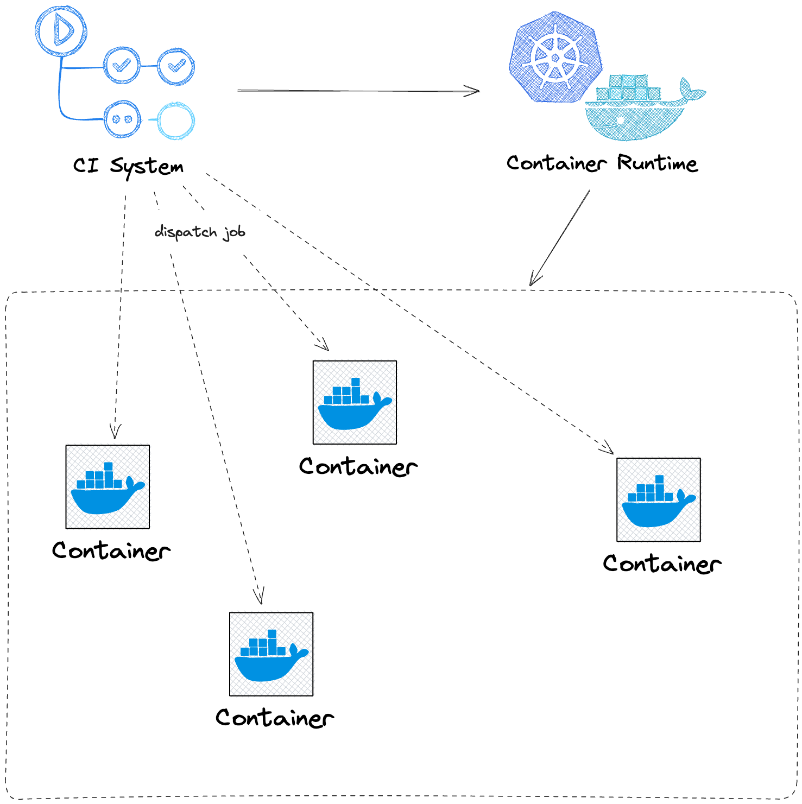

[CI (Continuous Integration)](https://en.wikipedia.org/wiki/Continuous_integration) originally means to merge code changes into a shared repository frequently. To achieve this, a _CI system_ is required to build, test, and deploy the code automatically. This post introduces the user interfaces design of CI systems with some widely used CI systems as examples.

## Container-Based Model

With the container technology becoming widly used and well-known, most modern CI systems use container-based model as its first option, if not the only option. In container-based model, the system runs steps (usually shell scripts) in containers. The CI environment is isolated from the host environment. And a brand new container is created for every run. Thus user (CI script developer) do not need to worry about the environment.

Terms used in different CI systems are different. No matter what term is used, there is usually an _one-per-container_ term, as the following table.

|                            | GitLab CI/CD | GitHub Actions | Jenkins  |  Dagger   |
| -------------------------- | :----------: | :------------: | :------: | :-------: |
| per event                  |   Pipeline   |    Workflow    | Pipeline | Function  |
|                            |    Stage     |                |          |           |
| per container (_baseline_) |     Job      |      Job       |  Stage   | Container |
|                            |    Script    |      Step      |   Step   |           |

To understand a CI system's model, choosing that one-per-container term as the baseline is a good start. For example, in GitLab CI/CD, every `Job` is running in a separate container. Inside each job, you can defind multiline `Script` to perform task steps in one container. `Pipeline` consists of jobs to run when an event is triggered, for instances, `merge request` or `push`. GitLab CI/CD employs `Stage` to group jobs that can be run in parallel, while other CI systems achieve this by composed jobs.

> Dagger detects the dependencies between containers and runs them in parallel if possible, that's why Dagger is named after the [DAG (Directed acyclic graph)](https://en.wikipedia.org/wiki/Directed_acyclic_graph).

Containers are not totally isolated. CI systems provide mechanisms for containers to communicate with each other. Caches and artifacts are two common mechanisms.

## The Lifetime of A Workflow

Let's take a look at the lifetime of a workflow.

First, the CI workflow is triggered. The most common way to trigger a workflow is webhooks, that is, sending a HTTP request to an endpoint of the CI system. The subject triggering the workflow is called an _event_. An event can be a `push`/`merge request` to a git repository, a `cron` job, or a manual trigger. That HTTP request usually contains information about the event so that the CI system can know what to do next. For example, upon a merge request is created, GitLab sends a request to CI system with the source/target branches. The CI system then knows which branch to checkout and run the workflow.

Second, the CI system finds the workflow template to start a workflow. It could be a one-for-all script set directly in the CI system. Git-Ops following the workflow-as-code practice, the workflow template is stored in the git repository (you might have seen `Jenkinsfile`, `.gitlab-ci.yml` or `.github/workflows/*.yml` in some repositories). The CI system checkout the given branch and find the workflow template file to execute different workflows for different branches.

Then the CI system runs the pre-defined workflow. As discussed above, the CI system dispatches jobs to containers in specific order. If possible, the CI system runs jobs in parallel. The CI system is responsible for the communication between containers, for example, canceling a job if its previous job fails. It is also responsible for managing the caches and artifacts of each container.

Finally, the CI system reports the result of the workflow, usually by updating the status of the event (via webhooks again), creating a comment on merge request, or even sending emails.

## Using Cache to Optimize CI

Now we browse the cache mechanism of CI systems and how to use it to speed up CI. As discussed above, the CI system provides an isolated environment for each job. But sometimes we don't want a totally fresh or pure environment. For example, we don't want to download all the dependencies or build the unchanged code again and again. Most CI systems provide a cache mechanism to deal with this.

Modern building systems track the changes of source files to reuse the immediate build results. Thinking about `make` and `Makefile`, `make` will check the timestamp of the source files and the build results. If the source files are not changed, `make` will not build the project again. Other building systems use checksum to detect the changes. These caches are usually stored in disk, e.g. `node_modules` for `npm`, `.gradle` for `gradle`, `.m2` for `maven`. That's why cache mechanism in CI systems works.

Cache mechanism in CI systems can be simply described as a persistent key-value store. The value is usually files or directories. After a workflow ends, the CI system will tarball and compress the files or directories in user given pathes and upload them to the cache store. Before another workflow starts, the CI system retrieves the cache from the store and restore it to the user given pathes. And this workflow can also update the cache after it ends.

Another thing that CI users should take care of is the cache key, i.e. naming the caches. Generally, there are two strategies: monolith cache and branch cache. In the former strategy, all the caches are named after the same key, thus all the workflows share the same cache. In this strategy, neither an unique source file be built twice nor a dependency be downloaded twice. But the monolith cache will become much huge over time, and there are many useless caches in it.

In the branch cache strategy, the cache keys are organized in a tree architecture. [GitHub `actions/cache`](https://github.com/actions/cache) accepts `restore-keys`, which is an ordered list of prefix-matched keys. Say a merge request from branch `dev` to branch `main`, it can use the cache of the same commit id. If not found, use the cache of the same merge request. Otherwise, the cache of the same branch and finally the main branch.
