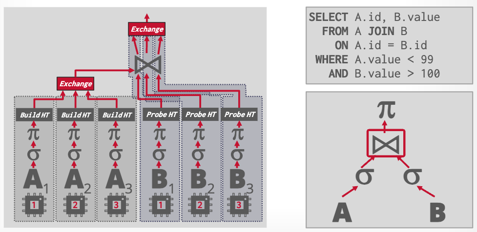
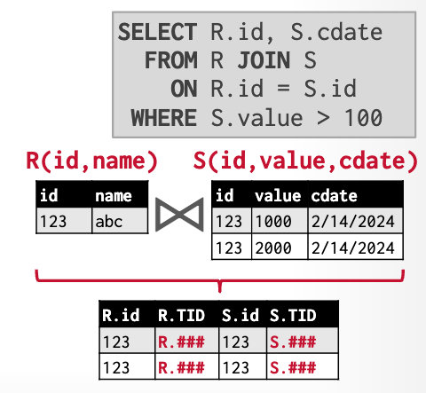

## _Lecture Note_ 05. Query Execution & Processing II

This lecture _is a quick overview of more design considerations when building an execution engine_.

### Parallel Execution

- **Inter-Query Parallelism** allows multiple queries to execute simultaneously
- **Intra-Query Parallelism** executes the operators of a single query in parallel

  - Intra-Operator (Horizontal)

    Coalesce results from children operators by an **exchange** operator, types of which can be _gather_, _distribute_ or _repartition_.

    

  - Inter-Operator (Vertical) or **Pipeline Parallelism**

### Operator Output

- Early Materialization

  

- Late Materialization

  

### Internal Representation

The DBMS cannot use the on-disk file format (Parquet or ORC) for execution directly. Instead, it converts the data into an in-memory internal representation and then propagates the data through the query plan.

Apache Arrow is the best choice for internal data representation (Andy's opinion). It's a self-describing, language-agnostic in-memory columnar data format, which is optimized for cache-efficient and vectorized execution engines.

### Expression Evaluation

Instead of traversing the expression tree for each tuple, Velox uses JIT compilation to evaluate the expression directly.

### Adaptive Execution

Adaptive Execution is a technique that allows to modify a query's plan and expression tree on execution based on the information gathered during the execution.

Tricks used in Velox:

- _Predicate Reordering_ decides the ordering of predicates based on their selectivity and computational cost
- _Column Prefetching_
- _Not Null Fast Paths_ skips null checking if input vector has no null values (known from the filter vector)
- _Elide ASCII Encoding Checks_
