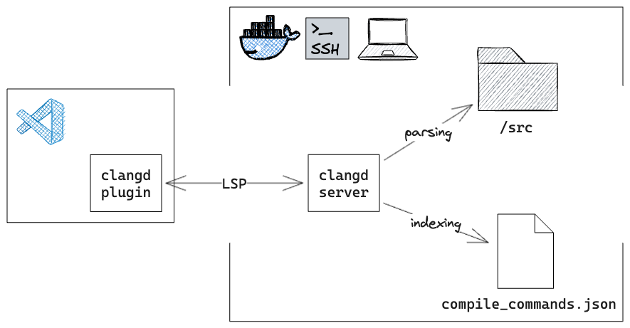

## TL;DR

1. Install VSCode plugin [`clangd`](https://marketplace.visualstudio.com/items?itemName=llvm-vs-code-extensions.vscode-clangd)
2. Install [`clangd`](https://clangd.llvm.org/installation.html#installing-clangd) in source code environment
   - (Local) install `clangd` locally
   - (Docker) install `clangd` inside the Docker container
   - (Remote) install `clangd` on the remote server
3. Adding flag `-DCMAKE_EXPORT_COMPILE_COMMANDS=1` to CMake command and rerun `cmake`
4. (_Optional_) Run VSCode command `clangd: Restart language server`

## Explained

Modern code editors uses LSP (Language Server Protocol) to provide consistent features (e.g. code completion, go-to-definition, and refactoring). LSP architecture is shown below, using `clangd` as an example.



LSP client handles editor commands and queries the server. The LSP server parses the source code and provides the results back to the client. Then the LSP client displays the results to the user.

`clangd` is a language server for C/C++, based on the Clang compiler. Since source files are not self-contained in C++, `clangd` requires `compile_commands.json` containing compile commands for every source file in a project. This file can be generated by CMake with `-DCMAKE_EXPORT_COMPILE_COMMANDS=1` flag.

Defaultly `clangd` uses `build/compile_commands.json`, but you can specify the path in `.clangd` configuration file. The following example of `.clangd` indicates `clangd` to use `build/clangd/complie_commands.json`:

```
CompileFlags:
  CompilationDatabase: build/clangd
```
