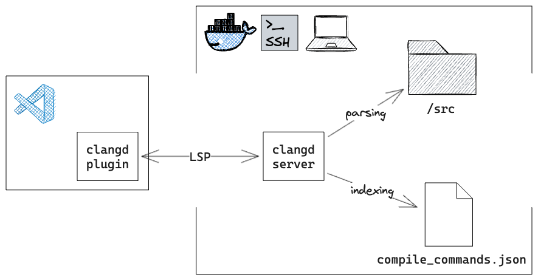
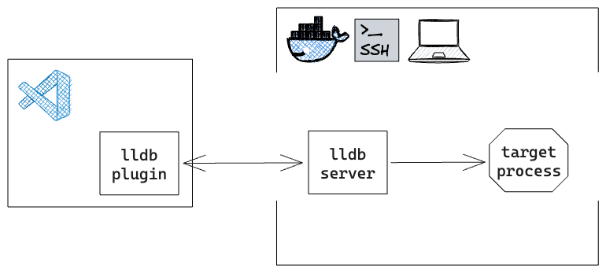

C/C++ isn't my usual go-to for work or play. My initial encounters with it were, let's say, a bit prickly.
There were `definition not found` errors all over the place, and the code completion was not as smart as modern languages.

Recently I was exploring some awesome projects written in C/C++ (say DuckDB).
After some research to configure the development environment, I discovered that with the help of powerful language tools, developing C/C++ can be as enjoyable as working with other modern languages.

In this post, I'm going to share my journey of setting up a C/C++ development environment. I hope it could be helpful for you.

## Use LSP-compatible code editor

I currently use Zed as my editor. It's sleek, it's speedy, and it's pretty cool.
Internally, it uses [clangd] as the language server. Thanks to LSP, all code editors today can provide consistent features (e.g. code completion, go-to-definition, and refactoring) powered by Clang toolchain. Thus the following steps should be also applicable to code editors that support LSP.

## Configure clangd

clangd provides a rich set of features out of the box. However, unlike modern languages, say Golang or Rust, C/C++ projects have no standard structure.
This _flexible_ structure can make it difficult for the language server to understand the project without proper configuration.

In particular, clangd uses [compilation database](https://clang.llvm.org/docs/JSONCompilationDatabase.html) to understand the source code. It's a JSON file providing compile commands for every source file in a project, and is usually generated by tools.

[clangd manual](https://clangd.llvm.org/installation#project-setup) describes how to generate this file for Cmake and Bazel projects. For example, the following command employs cmake to generate this file:

```bash
cmake -DCMAKE_EXPORT_COMPILE_COMMANDS=1
```

## Generate configuration using Bear

But, not all projects (like Postgres) use these build systems. In this case, [Bear](https://github.com/rizsotto/Bear) can generate it by recording a complete build. To generate the `compile_commands.json` file, install Bear and run `bear -- make`. Then clangd can understand the project and provide features like code completion and refactoring.

## Conclusion

So, ready to dive into C/C++ development? Here's what you need to do:

1. Use a code editor that supports LSP (e.g. Zed, VSCode, or Vim).
1. Choose [clangd] as the language server and provide it with a `compile_commands.json` file.
1. For Cmake/Bazel projects, use their built-in tools to generate that file. For other projects, use Bear.

[clangd]: https://github.com/zed-industries/zed/blob/main/docs/src/languages/cpp.md

---

Updated 2024-07-31

## How to Develop C/C++ with VSCode and Clangd

1. Install VSCode plugin [`clangd`](https://marketplace.visualstudio.com/items?itemName=llvm-vs-code-extensions.vscode-clangd)
2. Install [`clangd`](https://clangd.llvm.org/installation.html#installing-clangd) in source code environment
   - (Local) install `clangd` locally
   - (Docker) install `clangd` inside the Docker container
   - (Remote) install `clangd` on the remote server
3. Adding flag `-DCMAKE_EXPORT_COMPILE_COMMANDS=1` to CMake command and rerun `cmake`
4. (_Optional_) Run VSCode command `clangd: Restart language server`

### Explained

Modern code editors uses LSP (Language Server Protocol) to provide consistent features (e.g. code completion, go-to-definition, and refactoring). LSP architecture is shown below, using `clangd` as an example.



LSP client handles editor commands and queries the server. The LSP server parses the source code and provides the results back to the client. Then the LSP client displays the results to the user.

`clangd` is a language server for C/C++, based on the Clang compiler. Since source files are not self-contained in C++, `clangd` requires `compile_commands.json` containing compile commands for every source file in a project. This file can be generated by CMake with `-DCMAKE_EXPORT_COMPILE_COMMANDS=1` flag.

Defaultly `clangd` uses `build/compile_commands.json`, but you can specify the path in `.clangd` configuration file. The following example of `.clangd` indicates `clangd` to use `build/clangd/complie_commands.json`:

```
CompileFlags:
  CompilationDatabase: build/clangd
```

---

Updated 2024-07-31

## How to Debug C/C++ with VSCode and Remote LLDB

1. Install VSCode plugin [`Remote Development`](https://marketplace.visualstudio.com/items?itemName=ms-vscode-remote.vscode-remote-extensionpack) (be it container or SSH), and install [`LLDB DAP`](https://marketplace.visualstudio.com/items?itemName=llvm-vs-code-extensions.lldb-dap) in the remote environment
2. Install `lldb` in source code environment
3. Build the project with debug symbols
4. Configure `.vscode/launch.json`
   ```json
   {
   	"version": "0.2.0",
   	"configurations": [
   		{
   			"type": "lldb-dap",
   			"request": "launch",
   			"name": "Launch",
   			"program": "${workspaceRoot}/<your program>",
   			"args": [],
   			"env": [],
   			"cwd": "${workspaceRoot}"
   		}
   	]
   }
   ```

### Explained

Modern debuggers employ client/server architecture to provide debugging features. The architecture is shown below, using `lldb` as an example.



The debugger client (e.g. VSCode) sends commands to the debugger server (e.g. `lldb`) and receives the results. The debugger server interacts with the target program and provides the results back to the client. Then the debugger client displays the results to the user.

`lldb` is a debugger for C/C++, based on the LLVM project. To debug a program with `lldb`, you need to build the program with debug symbols.
