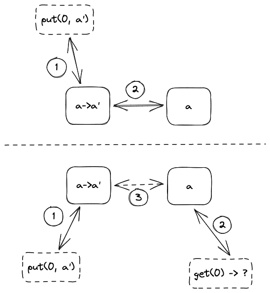

## TL;DR

分布式系统研究如何让多台计算机协同工作，以达到更好的性能、具有容错、提供一致的服务。

## 一个读写服务

Jo 用他的服务器运行一个查询服务，这个服务提供一个接口：`get(index)` 读取 `index` 位置的值。

Jo 把这个服务运行在一个微型机上，用来为他的个人博客提供服务，当时他的网站还没有多少访问量，因此这个服务器正好胜任。某一天，Jo 写出了一篇爆款文章，他的网站涌入了上万的访问，这个微型机明显不能支持这样的流量，于是他的网站挂掉了。Jo 想要用 ***另一台*** 闲置的微型机来扩充这个服务。

为了不重写整个网站的代码，两台微型机组成的系统应该提供 ***与单机一样的接口***。Jo 想到一个最简单的方案，让两台机器都运行相同的服务，博客网站随机地请求其中的一个，这样两个服务器大致承载一半的流量，整个服务**能够承载的访问量**扩大了一倍。

Jo 还发现了另一个好处，他把两台机器分别放在家里和学校，当学校的网络故障时，家里的机器不受影响，整个服务仍然能正常工作（虽然能够承载的访问量下降了）；反之，当家里停电时，学校里的机器还能正常运行。也就是说，这个查询服务具有了**容错**。

某一天，Jo 打算升级他的网站，他需要让这个查询服务支持另一个接口：`put(index, value)` 把 `index` 位置的值更新为 `value`。如果是原来的单机结构，需要的改动十分简单。但是，对于两台机器组成的系统，还需要考虑如何让两台机器的 ***状态保持一致***：在一台服务器上的更新应该能在另一台服务器上查询到。

Jo 想到了一个方案：当任何一个服务器收到 `put()` 时，它们都要把更新同步给另一方。这个方案的一个问题是，如果两台服务器同时收到了对同一个位置的修改，即发生 ***冲突*** 时，它们应该如何处理呢？

Jo 想到了另一个方案，只有一个服务器接受 `put()` 请求，这样就不会产生冲突，但是这样的系统对于写操作的最大访问量并没有提升。

并且这两种方案都带来了一个新的问题：写操作的延迟要比单机提高了一倍！因为一次写操作中间增加了与其他机器同步的通信开销。如果按照同样的方式扩展这个系统，越多的机器就会带来越高的延迟！对于这个问题，Jo 想到的解决办法是 ***异步更新***：写操作完成后再更新其他机器。但是如果在更新期间读取其他机器上的值，就会出现数据不一致的问题。

||所有机器处理写操作|一台机器处理写操作|
|:-:|:-:|:-:|
|同步更新|高延迟；存在冲突|高延迟；写操作访问量低|
|异步更新|不一致；存在冲突|不一致；写操作访问量低|

## 分布式系统

读者或许很快就能想到一个更简单的解决方案：换一个更好的机器。是的，对于 Jo 的网站，或许用一个性能更好的机器就能解决最初的问题，而且也不会引入这些更复杂的问题。Jo 马上就能反驳：单机服务器缺少**容错**。

另一个原因是，随着摩尔定律的失效，单个计算机的算力不能无限增长。对于 Google 这样的公司，她们的服务访问量以亿万计数，在可见的未来，没有任何单机能够承载这样的访问量，因此研究 ***如何让多台计算机协同运作*** 是有必要的，这就是**分布式系统**。

与 Jo 折腾他的玩具分布式系统一样，工程师和研究者也在解决相同的问题：

1. 如何利用多台计算机提高**容错**？
   
   如果这个系统十分“精密”，需要所有的计算机都正常工作才能运行，那么这个系统运作的概率比单个计算机正常运行的概率要低得多。用一个简单的概率乘法模型来计算，每台计算机正常工作的概率是 $p$，$n$ 台计算机组成的系统只有 $p^n$ 的概率正常工作。如果 Google 的服务器按照这样运行，那么她们的服务几乎不可用；而且，她们购买越多的机器，系统能运行的可能就越低！

   相反，如果这个系统有一定容错，在其中一些计算机失效的情况下还能运行，那么整个系统的容错就比单台计算机更高。

2. 如何利用多台计算机提高**性能**？性能包括了**延迟**和**容量**。前者是指单次请求需要经过多久才能完成；后者是指系统能承受多少 *并发* 的请求。

3. 如何在多台计算机之间保持**一致性**？

4. 容易被忽视的一点是，如何使系统保持**简单**？分布式系统领域中有很多例子能够说明，简单的系统更可能取得成功，因为它们容易实现和维护。
