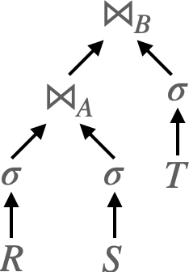
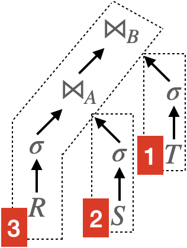

DuckDB implements morsel-driven parallelism, a NUMA-aware query evaluation framework. This post introduces the morsel model and its implementation in DuckDB.

## Morsel Model

Morsel model is an improvement on execution engines. Most traditional execution engines employ the volcano model. To compare these two models, we consider the following query plan from the origin paper:

$$
\sigma(R) \bowtie_A \sigma(S) \bowtie_B \sigma(T)
$$

The relational algebra expression above will be translated into a physical plan as shown below. Here $\bowtie$ represents a hash join, and its LHS is the probe side, and RHS is the build side.



In the volcano model, each operator represents a node in the physical plan graph. And each operator has a `Next` method. Say a hash join operator having fields `left` and `right`, its `Next` method will be like:

```text
HashJoin::Next() {
    for t = right.Next(); do
        build_hash_table(t);
    done
    for t = left.Next(); do
        if probe_hash_table(t); do
            yield join(t);
        done
    done
}
```

In the morsel model, operators are grouped into pipelines. The above query plan can be divided into three pipelines as follows.



Operators of one **pipeline** can be executed before others finish. In pipeline 1, for example, table scan, filter, and build hash table can be executed concurrently. That is, when the table scan operator reads a morsel of data, although the table is not fully scanned, the filter operator can start processing on that morsel of data.

A **pipeline breaker** is a operator that must finish before its next operator can start, for example, sort operator (`order by`). In the above example, the build side of hash join operator is a pipeline breaker (the probe side is not). Pipeline breaker breaks the plan into multiple pipelines, and creates a dependency between them.

The main idea of the morsel model is to apply as much as possible operators on a morsel of data before moving to the next morsel. This can reduce the overhead of transfer data between cores in modern NUMA architectures.

## DuckDB Implementation

[TODO]

## References

1. [_Morsel-Driven Parallelism: A NUMA-Aware Query Evaluation Framework for the Many-Core Age_](https://db.in.tum.de/~leis/papers/morsels.pdf) originally proposes the morsel model.
