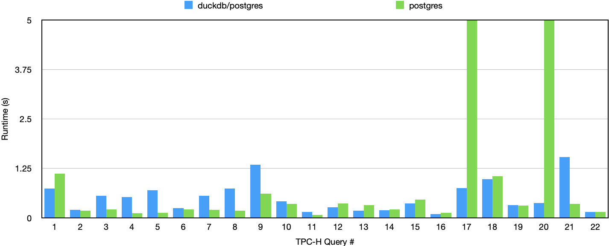

## OLAP Workloads

OLAP is short for Online Analytical Processing. Say a bank having a database of all accounts. The bank has 2 main workloads: (1) during the day, the bank processes transactions, for example, transferring money between accounts; (2) at the end of the day, the bank analyzes the data to support bussiness decisions, for example, generating reports of the amount of money transferred in each area.

The first workload is a typical OLTP (Online Transaction Processing) workload, in which many small transactions are handled concurrently at the same time, and each transaction might modify a small amount of data. The second workload is a OLAP workload, in which a few queries are executed on a large amount of data.

TPC-H is a standard benchmark for OLAP workloads.
The following two queries are Q1 and Q3 from TPC-H. Although the schemas are not provided, the first letter of each column name hints the table (say `l_returnflag` is from `lineitem`).

```sql
SELECT
    l_returnflag,
    l_linestatus,
    sum(l_quantity) AS sum_qty,
    sum(l_extendedprice) AS sum_base_price,
    sum(l_extendedprice * (1 - l_discount)) AS sum_disc_price,
    sum(l_extendedprice * (1 - l_discount) * (1 + l_tax)) AS sum_charge,
    avg(l_quantity) AS avg_qty,
    avg(l_extendedprice) AS avg_price,
    avg(l_discount) AS avg_disc,
    count(*) AS count_order
FROM
    lineitem
WHERE
    l_shipdate <= CAST('1998-09-02' AS date)
GROUP BY
    l_returnflag,
    l_linestatus
ORDER BY
    l_returnflag,
    l_linestatus;
```

```sql
SELECT
    l_orderkey,
    sum(l_extendedprice * (1 - l_discount)) AS revenue,
    o_orderdate,
    o_shippriority
FROM
    customer,
    orders,
    lineitem
WHERE
    c_mktsegment = 'BUILDING'
    AND c_custkey = o_custkey
    AND l_orderkey = o_orderkey
    AND o_orderdate < CAST('1995-03-15' AS date)
    AND l_shipdate > CAST('1995-03-15' AS date)
GROUP BY
    l_orderkey,
    o_orderdate,
    o_shippriority
ORDER BY
    revenue DESC,
    o_orderdate
LIMIT 10;
```

From the [queries](https://github.com/duckdb/duckdb/tree/main/extension/tpch/dbgen/queries) in TPC-H, we can tell that OLAP workloads are usually involving full table scans, large aggregations, and joins.



With additional network traffic, DuckDB is still competitive with Postgres in performance. In Q17 and Q20, DuckDB is even faster while Postgres timeouts. Later in this post, we'll look deeper into it.

## Morsel-Based Execution

Let's consider a simple query involving a join of three tables.

```sql
create table R(A, B, C);
create table S(A, B, C);
create table T(A, B, C);

select *
from R, S, T
where R.A = S.A and S.B = T.B
  and R.C > 10 and S.C > 20 and T.C > 30;
```


$$
\sigma(R) \bowtie_A \sigma(S) \bowtie_B \sigma(T)
$$


```cpp
OperatorResultType PhysicalFilter::ExecuteInternal(
    ExecutionContext &context,
    DataChunk &input,
    DataChunk &chunk,
    GlobalOperatorState &gstate,
    OperatorState &state
) const override;
```

```cpp
SourceResultType PhysicalOrder::GetData(
    ExecutionContext &context,
    DataChunk &chunk,
    OperatorSourceInput &input
) const override;
```

```cpp
SinkResultType PhysicalOrder::Sink(
    ExecutionContext &context,
    DataChunk &chunk,
    OperatorSinkInput &input
) const override;
```

Pipeline & Pipeline Breaker

Pipeline break is a sink, for example, `hash join` or `order by`.

`PhysicalJoin::BuildJoinPipelines` build rhs (build side) as child pipeline, and lhs (probe side) continues as parent pipeline.

```cpp
class PipeLine: {
private:
	//! The source of this pipeline
	optional_ptr<PhysicalOperator> source;
	//! The chain of intermediate operators
	vector<reference<PhysicalOperator>> operators;
	//! The sink (i.e. destination) for data; this is e.g. a hash table to-be-built
	optional_ptr<PhysicalOperator> sink;

	//! The parent pipelines (i.e. pipelines that are dependent on this pipeline to finish)
	vector<weak_ptr<Pipeline>> parents;
	//! The dependencies of this pipeline
	vector<weak_ptr<Pipeline>> dependencies;
}
```

## Optimizer

Now let's back to the TPC-H Q17. Most parts of this query is simple, the only noticable part is the subquery. This subquery is known as correlated subquery, as it references column from the outer query (`p_partkey`).

```sql
SELECT
    sum(l_extendedprice) / 7.0 AS avg_yearly
FROM
    lineitem,
    part
WHERE
    p_partkey = l_partkey
    AND p_brand = 'Brand#23'
    AND p_container = 'MED BOX'
    AND l_quantity < (
        SELECT
            0.2 * avg(l_quantity)
        FROM
            lineitem
        WHERE
            l_partkey = p_partkey);
```

Logically, correlated subquery is executed for each row of the outer query. I test MySQL and Postgres, both of them execute subquery for each row of the outer query. DuckDB, however, is smart enough to unnest the subquery into join. In fact, DuckDB optimizer is too intelligent that it does not implement subquery execution plan. Instead, it unnests any correlated subquery.

Q20 is the same.

```sql
SELECT
    s_name,
    s_address
FROM
    supplier,
    nation
WHERE
    s_suppkey IN (
        SELECT
            ps_suppkey
        FROM
            partsupp
        WHERE
            ps_partkey IN (
                SELECT
                    p_partkey
                FROM
                    part
                WHERE
                    p_name LIKE 'forest%')
                AND ps_availqty > (
                    SELECT
                        0.5 * sum(l_quantity)
                    FROM
                        lineitem
                    WHERE
                        l_partkey = ps_partkey
                        AND l_suppkey = ps_suppkey
                        AND l_shipdate >= CAST('1994-01-01' AS date)
                        AND l_shipdate < CAST('1995-01-01' AS date)))
            AND s_nationkey = n_nationkey
            AND n_name = 'CANADA'
        ORDER BY
            s_name;
```
