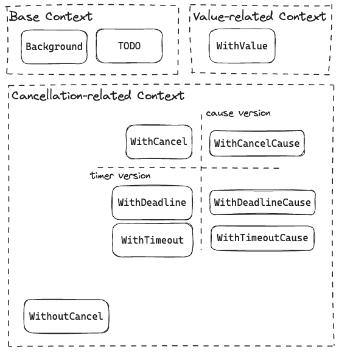
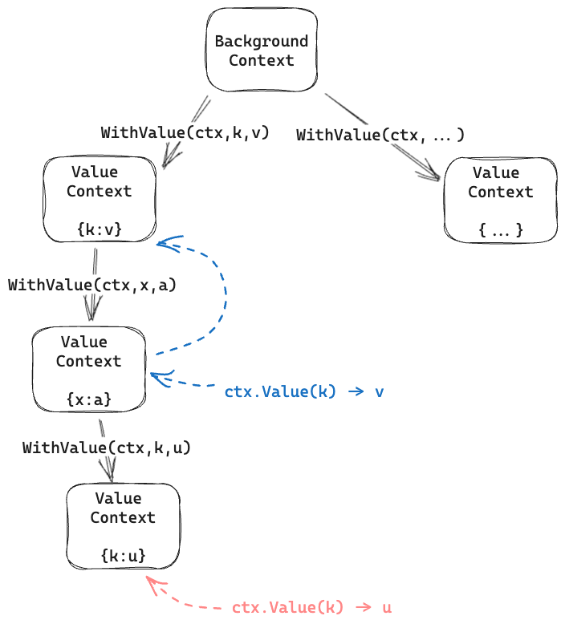

[`context`](https://pkg.go.dev/context) is one of the most commonly used standard library package in Golang.
This package is originally designed to provide a consistant interface of passing request-scoped values and cancellation signals across different libraries used in handling a request.

In this post, we explore the internal of `context.Context` and how it is implemented.

## First Look

The core interface [`context.Context`](https://pkg.go.dev/context#Context) is defined as follows. `Value(key any) any` is used to query a scoped value by its key, while the other methods are related to cancellation signals (discussed later).

```go
type Context interface {
	Deadline() (deadline time.Time, ok bool)
	Done() <-chan struct{}
	Err() error
	Value(key any) any
}
```

The package provides several context creation functions. [`Background`] and [`TODO`] are used to create a base context. These two type of contexts are almost the same, except the semantics of `TODO` is a placeholder.

[`WithValue`] creates a new context with an additional KV pair other than the parent context.

```go
func Background() Context
func TODO() Context
func WithValue(parent Context, key, val any) Context
func WithCancel(parent Context) (ctx Context, cancel CancelFunc)
func WithCancelCause(parent Context) (ctx Context, cancel CancelCauseFunc)
func WithoutCancel(parent Context) Context
func WithDeadline(parent Context, d time.Time) (Context, CancelFunc)
func WithDeadlineCause(parent Context, d time.Time, cause error) (Context, CancelFunc)
func WithTimeout(parent Context, timeout time.Duration) (Context, CancelFunc)
func WithTimeoutCause(parent Context, timeout time.Duration, cause error) (Context, CancelFunc)
```

The other types of contexts are cancellation related, among which [`WithCancel`] is the core. It creates a new context with a corresponding `cancel` function, which can be used to cancel the context and all its descendants.

[`WithDeadline`] and [`WithTimeout`] are similar to [`WithCancel`], but with a timer to automatically cancel the context after a certain time.

In Go 1.20, [`WithCancelCause`], [`WithDeadlineCause`], and [`WithTimeoutCause`] are added to provide a way to pass a cancellation cause.

[`WithoutCancel`] create a context detached from the parent's cancellation chain.



In the following sections, we will dive into the implementation of two core functionalities: passing scoped values and cascading cancelation signals.

## Passing Scoped Values

The [internal structure](https://cs.opensource.google/go/go/+/refs/tags/go1.22.0:src/context/context.go;l=728) of a value context consists of a parent context and a key-value pair.

```go
type valueCtx struct {
	Context
	key, val any
}

func WithValue(parent Context, key, val any) Context {
	/* ignore: sanity check */
	return &valueCtx{parent, key, val}
}
```

To [query](https://cs.opensource.google/go/go/+/refs/tags/go1.22.0:src/context/context.go;l=759) a value, it goes through the chain of `Context` until it finds a `valueCtx` with the key.
Thus if the child context has a value with the same key, it will shadow the parent's value, while its siblings are still able to access the parent's value.

```go
func (c *valueCtx) Value(key any) any {
	if c.key == key {
		return c.val
	}
	return value(c.Context, key)
}

func value(c Context, key any) any {
	for {
		switch ctx := c.(type) {
		case *valueCtx:
			if key == ctx.key {
				return ctx.val
			}
			c = ctx.Context
		case *cancelCtx, withoutCancelCtx, *timerCtx:
            /* ... */
			c = ctx.Context
		case backgroundCtx, todoCtx:
			return nil
		default:
			return c.Value(key)
		}
	}
}
```

The process of querying a value is illustrated as follows.



## Cascading Cancellation Signals

The following snippet shows the common usage of cancelable context. A job creates a child context from the parent context and passes it to a task. Upon an error, the job cancels the context. In each step, the task checks whether the context is canceled, and early returns if so.

```go
func job(ctx context.Context) {
    ctx, cancel := context.WithCancel(ctx)
    go task(ctx)

    if /* on error */ {
        cancel()
    }
}

func task(ctx context.Context) error {
    for i := 0; i < 3; i++ {
        select {
        case <-ctx.Done():
            return ctx.Err()
        default:
            step(i)
        }
    }
    return nil
}
```

The `Context.Done` method returns a read-only channel, which will never return a value but only be closed when the context is canceled. It's common to check the `Done` channel in a non-blocking manner (`select` with a `default` case). The `Err` method returns the cancellation error and should be only called after the `Done` channel returns.

In the rest of this section, we will go through the lifecycle of a context created by [`WithCancel`].

First, let's look at the [internal structure](https://cs.opensource.google/go/go/+/refs/tags/go1.22.0:src/context/context.go;l=421) and the creation of a cancel context. On creation, it simply creates a wrapper of the parent context and registers itself to the parent's cancellation chain.

```go
type cancelCtx struct {
	Context

	mu       sync.Mutex            // protects following fields
	done     atomic.Value          // of chan struct{}, created lazily, closed by first cancel call
	children map[canceler]struct{} // set to nil by the first cancel call
	err      error                 // set to non-nil by the first cancel call
	cause    error                 // set to non-nil by the first cancel call
}

func WithCancel(parent Context) (ctx Context, cancel CancelFunc) {
	c := withCancel(parent)
	return c, func() { c.cancel(true, Canceled, nil) }
}

func withCancel(parent Context) *cancelCtx {
	if parent == nil {
		panic("cannot create context from nil parent")
	}
	c := &cancelCtx{}
	c.propagateCancel(parent, c)
	return c
}
```

`propagateCancel` will be discussed more detailed later. For now we just assume it registers itself to the parent's `children` field, as follows.

```go
func (c *cancelCtx) propagateCancel(parent Context, child canceler) {
	c.Context = parent

    p.mu.Lock()
    if p.children == nil {
        p.children = make(map[canceler]struct{})
    }
    p.children[child] = struct{}{}
    p.mu.Unlock()
    return
}
```

When asked if the context is done, it returns the channel stored in the atomic field `done`. If the channel is not created, it creates one and stores it in the field. This lazy creation is to avoid the overhead of creating an unused channel.

```go
func (c *cancelCtx) Done() <-chan struct{} {
	d := c.done.Load()
	if d != nil {
		return d.(chan struct{})
	}
	c.mu.Lock()
	defer c.mu.Unlock()
	d = c.done.Load()
	if d == nil {
		d = make(chan struct{})
		c.done.Store(d)
	}
	return d.(chan struct{})
}
```

When `cancel` is called, it sets the `err` and `cause` fields to the given error. Then, if the `done` channel is created, it closes the channel. Finally, it cancels all its children cascadingly.

```go
func (c *cancelCtx) cancel(removeFromParent bool, err, cause error) {
	if err == nil {
		panic("context: internal error: missing cancel error")
	}
	if cause == nil {
		cause = err
	}
	c.mu.Lock()
	if c.err != nil {
		c.mu.Unlock()
		return // already canceled
	}
	c.err = err
	c.cause = cause
	d, _ := c.done.Load().(chan struct{})
	if d == nil {
		c.done.Store(closedchan)
	} else {
		close(d)
	}
	for child := range c.children {
		// NOTE: acquiring the child's lock while holding parent's lock.
		child.cancel(false, err, cause)
	}
	c.children = nil
	c.mu.Unlock()

	if removeFromParent {
		removeChild(c.Context, c)
	}
}
```

Recall that `WithCancel` returns a function literal `c.cancel(true, Canceled, nil)` as the `cancel` function. The first argument `true` indicates that the child context should be removed from the parent's cancellation chain, avoiding the redundant cancellation from the parent. And the second argument `Canceled` is a predefined error value in the package.

Now we go back to the `propagateCancel` method. When a cancelable context is created, it calls this method to register itself to the parent's cancellation chain (in particular, the first ancestor of type `*cancelCtx`). First, this method ensures that the parent context is cancelable and has not been canceled. Then, it adds itself to the parent's `children` map. The creation of the `children` map is lazy, the same as the `done` channel.

```go
func (c *cancelCtx) propagateCancel(parent Context, child canceler) {
	c.Context = parent

	done := parent.Done()
	if done == nil {
		return // parent is never canceled
	}

	select {
	case <-done:
		// parent is already canceled
		child.cancel(false, parent.Err(), Cause(parent))
		return
	default:
	}

	if p, ok := parentCancelCtx(parent); ok {
		// parent is a *cancelCtx, or derives from one.
		p.mu.Lock()
		if p.err != nil {
			// parent has already been canceled
			child.cancel(false, p.err, p.cause)
		} else {
			if p.children == nil {
				p.children = make(map[canceler]struct{})
			}
			p.children[child] = struct{}{}
		}
		p.mu.Unlock()
		return
	}

	if a, ok := parent.(afterFuncer); ok {/*...*/}

	goroutines.Add(1)
	go func() {
		select {
		case <-parent.Done():
			child.cancel(false, parent.Err(), Cause(parent))
		case <-child.Done():
		}
	}()
}
```

We skip the case that the parent context is an `afterFuncer` in the post. The last case is used for user-defined context types, which creates a goroutine to monitor the parent's cancellation signal. In my humble opinion, library authors should consider composing a `cancelCtx` to avoid an extra goroutine.

We have covered the core implementation of `WithCancel`. Now let's briefly go through the timer version `WithDeadline` and `WithTimeout`.

```go
func WithTimeout(parent Context, timeout time.Duration) (Context, CancelFunc) {
	return WithDeadline(parent, time.Now().Add(timeout))
}
func WithDeadline(parent Context, d time.Time) (Context, CancelFunc) {
	return WithDeadlineCause(parent, d, nil)
}
func WithDeadlineCause(parent Context, d time.Time, cause error) (Context, CancelFunc) {
	if parent == nil {
		panic("cannot create context from nil parent")
	}
	if cur, ok := parent.Deadline(); ok && cur.Before(d) {
		// The current deadline is already sooner than the new one.
		return WithCancel(parent)
	}
	c := &timerCtx{
		deadline: d,
	}
	c.cancelCtx.propagateCancel(parent, c)
	dur := time.Until(d)
	if dur <= 0 {
		c.cancel(true, DeadlineExceeded, cause) // deadline has already passed
		return c, func() { c.cancel(false, Canceled, nil) }
	}
	c.mu.Lock()
	defer c.mu.Unlock()
	if c.err == nil {
		c.timer = time.AfterFunc(dur, func() {
			c.cancel(true, DeadlineExceeded, cause)
		})
	}
	return c, func() { c.cancel(true, Canceled, nil) }
}
type timerCtx struct {
	cancelCtx
	timer *time.Timer // Under cancelCtx.mu.

	deadline time.Time
}
```

The `timerCtx` is a wrapper of `cancelCtx` with additional `timer` and `deadline` fields. The `timer` field employs the [`time.AfterFunc`](https://pkg.go.dev/time#AfterFunc) function to execute `c.cancel(true, DeadlineExceeded, cause)` after the deadline. The `deadline` field records the deadline time and can be queried by the `Deadline` method. This method is usually used to determine whether a time-consuming step should be started.

Now we have covered the core of `context` package itself. In the following section, we will look at some standard library packages that use `context` to learn how to use it properly.

## Case Study: `runtime/trace`

[`runtime/trace`](https://pkg.go.dev/runtime/trace) is a package used to trace the execution of a Go program. It employs `context` to pass the trace context without an explicit parameter. The following snippet shows the usage from the user's perspective.

```go
func MyTask(ctx context.Context) {
    ctx, task := trace.NewTask(ctx, "MyTask")
    defer task.End()

    // ... do something
}
```

Inside the `trace` package, the `NewTask` function retrieves the current task from the parent context, creates a sub-task, and returns the new context with the sub-task.

```go
type traceContextKey struct{}

func NewTask(pctx context.Context, taskType string) (ctx context.Context, task *Task) {
	pid := fromContext(pctx).id
	id := newID()
	userTaskCreate(id, pid, taskType)
	s := &Task{id: id}
	return context.WithValue(pctx, traceContextKey{}, s), s
}

func fromContext(ctx context.Context) *Task {
	if s, ok := ctx.Value(traceContextKey{}).(*Task); ok {
		return s
	}
	return &bgTask
}
```

_Lesson learned_

1. Use package level context key (private type `traceContextKey` in this case) to avoid key conflicts
1. Provide a function to retrieve the value from the context

## Conclusion

In this post, we explore the `context` package in Go standard library. First we introduce the common usage of `context.Context`, then follow two threads of core functionality, passing scoped values and cascading cancellation signals, to dive into its implementation. In the cascading cancellation signals, we go through the lifecycle of a cancelable context and briefly look at its variants. Finally, we look at a case study of the `runtime/trace` package to learn some best practices.

## Further Reading

1. The Go blog [_Go Concurrency Patterns: Context_](https://go.dev/blog/context) describes the motivation of `context` and its usage in Google.
1. My previous post [_All's Well That Ends Well_](/post/alls-well-that-ends-well/) introduces using `context` to implement a common pattern that a group of tasks should be canceled when any of them fails.
1. Issue [#57928 context: add AfterFunc](https://github.com/golang/go/issues/57928) discusses the motivation of `AfterFunc`, in short, to terminate a blocking call (e.g. network IO) efficiently.
1. Issue [#40221 context: add WithoutCancel](https://github.com/golang/go/issues/40221) discusses the motivation of `WithoutCancel`. In short, some contexts, **rollback/cleanup** or **long-running operations** for instance, should not be canceled when the parent is canceled.

[`Background`]: https://pkg.go.dev/context#Background
[`TODO`]: https://pkg.go.dev/context#TODO
[`WithValue`]: https://pkg.go.dev/context#WithValue
[`WithCancel`]: https://pkg.go.dev/context#WithCancel
[`WithDeadline`]: https://pkg.go.dev/context#WithDeadline
[`WithTimeout`]: https://pkg.go.dev/context#WithTimeout
[`WithCancelCause`]: https://pkg.go.dev/context#WithCancelCause
[`WithDeadlineCause`]: https://pkg.go.dev/context#WithDeadlineCause
[`WithTimeoutCause`]: https://pkg.go.dev/context#WithTimeoutCause
[`WithoutCancel`]: https://pkg.go.dev/context#WithoutCancel
