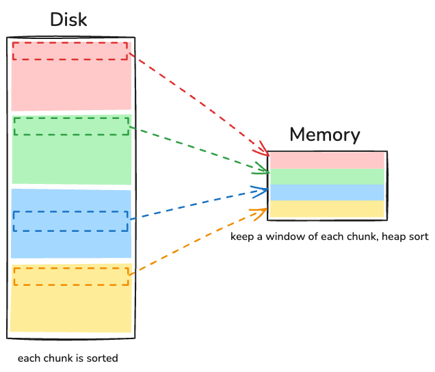

## External Sorting

_Quiz_: Given a file containing 10 million integers. The memory can only hold 1 million integers at a time. Sort this file.

_Approach_: **N-way merge**.

1. Split and sort:
   Split the file into 10 chunks, each of which fits in memory. Sort each chunk in memory.
2. N-way merge:
   Load the first integer of each chunk into memory and organize them in a heap.
   Pop the minimum integer from the heap, which is also the smallest integer in the file, and write it to the output file.
   Load the next integer from the corresponding chunk into the heap.
   Repeat this process.

   To reduce disk accesses, keep a window of each chunk in memory and move to the next window only when the current window is consumed.

   

## External Aggregation

_Quiz_: Given a file containing 10 million key-value pairs. The memory can only hold 1 million key-value paris at a time. Compute the sum of values for each unique key.

_Approach #1_: **Merge-based aggregation**.
The steps are almost the same as N-way merge. During heap operations, pop all the pairs with the same key and perform the aggregation. Since the pairs are sorted, no values will be missed.

_Approach #2_: **Hash-based aggregation**.

1. Split and pre-aggregation:
   Split the file into smaller chunks that fit into memory. For each chunk, perform pre-aggregation.
2. Hash-based partitioning:
   Write the aggregated results of each chunk to different partitions based on hash values. If a partition is too large to fit in memory, re-partition it.
3. Intra-partition aggregation:
   For each partition, perform post-aggregation. Since pairs are partitioned by their key hash, the pairs with the same key are always in the same partition (i.e., _disjoint_).

## External Algorithms

Both external sorting and external aggregation belong to [external algorithms](https://en.wikipedia.org/wiki/External_memory_algorithm), which extend simple algorithms from the unbounded memory model to the bounded memory model.
In practice, these algorithms also consider other factors, such as memory affinity (e.g., NUMA in modern CPUs) and disk affinity (e.g., local versus remote disks in distributed systems).

External algorithms are very important and widely used in databases, as databases are designed to handle large amounts of data, often exceeding the available memory.
Additionally, dividing simple algorithms into parallel sub-tasks enables intra-operator parallelism in databases, which significantly improves database performance in multi-core or distributed environments.

---

1. [External Memory Algorithms and Data Structures](https://courses.cs.duke.edu/fall05/cps130/lectures/vitter.papers/Vit.IO_survey.pdf) is a comprehensive review of external algorithms.
1. [External Aggregation in DuckDB](https://duckdb.org/2024/03/29/external-aggregation.html#external-aggregation) and [Parallel Grouped Aggregation in DuckDB](https://duckdb.org/2022/03/07/aggregate-hashtable.html) introduce how DuckDB implements a fully parallel aggregate operator.
