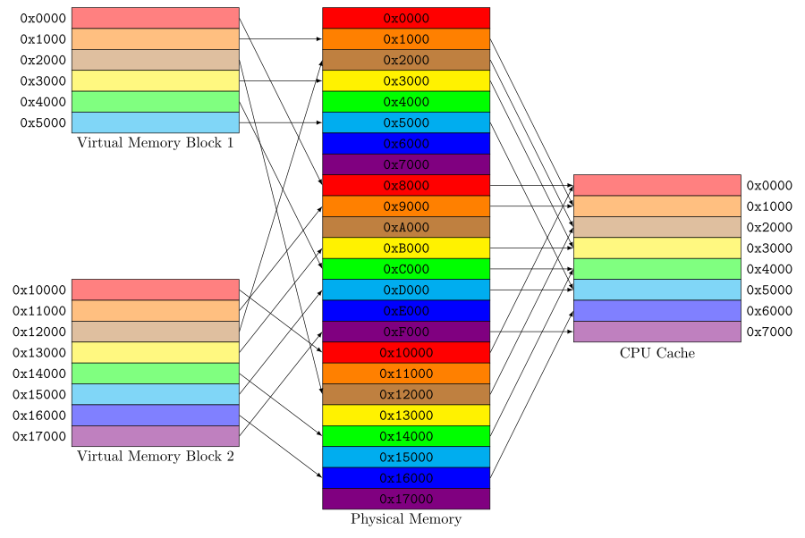

**Locality** is a universal behavior that computational processes tend to refer repeatedly to subsets of their resources over extended time intervals.

**Temporal locality** means that references to the same objects are grouped in time, and **spatial locality** means that objects close to each other tend to be referenced together.

## Models of Locality

### Static Representation

Objects could be ordered so that their probabilities of use follow the relation

$$
p_1 > p_2 > p_3 > ... > p_k > ...
$$

And they often follow a Zipf Law, which means that $p_k$ is proportional to $1/k$.

There is no differentiation into phases in this model. So empirically this model overestimates the average locality size by factors of 2 or 3.

### Phase-transition

Execution of a computation consists of a series of phases; _phase_ $i$ has holding _time_ $T_i$ and _locality set_ $L_i$. The locality set is the set of objects referenced in the phase. A particular object is referenced only in the phases in which it is a member of the locality set.

Thus, the history of the computation appears as a sequence,

$$
(L_1, T_1), (L_2, T_2), ..., (L_i, T_i), ...
$$

In each phase state, the model uses a static representation above for the locality set.

### Working Set

The working set model defines $W(t,T)$ as the set of objects referenced in the time window of length $T$ extending backward from the current time $t$.

A distance function gives a single measure of temporal and spatial locality. $D(x,t)$ measures the distance from the current execution point of the process to an object $x$ at time $t$. Object $x$ is in the locality set at time $t$ if the distance is within a threshold: $D(x,t) \leq T$.

It is usually possible to choose the window size $T$ so that it is contained within phases most of time, in which case the working set measures the current locality set. Thus, the working set is a good way to track the localities and phases of a program dynamically.

## Locality Principle in Locality Model

> 1. Computational processes pass through a sequence of phases.
> 2. The locality sets of phases can be inferred by applying a distance function to a program’s address trace observed during a backward window.
> 3. Memory management is optimal when it guarantees each program that its locality sets will be present in high-speed memory.

## Modern Models of Locality: Context Awareness

Context awareness embraces four key ideas:

|  Modern Model  | Original Model                                                           |
| :------------: | ------------------------------------------------------------------------ |
|    Observer    | the execution point of the computational process                         |
|  Neighborhood  | the current locality set                                                 |
|   Inference    | the distance function                                                    |
| Optimal Action | to guarantee that the current locality is present in a processor’s cache |

### An observer

The observer is the agent who is trying to accomplish tasks with the help of software, and who places expectations on its function and performance. In most cases, the observer is the user who interacts with software. In some cases, such as a program that computes a mathematical model, the observer can be built into the software itself.

### Neighborhoods

One or more sets of objects that are most relevant to the observer by some metric at any given time.

### Inference

A method of identifying the most relevant objects by monitoring the observer’s actions and interactions and other information about the observer contained in the environment.

Inference can be any reasonable method that measures the content of neighborhoods.

### Optimal actions

An expectation that the observer will complete work in the shortest time if neighborhood objects are ready accessible in nearby caches.

Optimal actions are performed by the software on behalf of the observer. These actions can come either from inside the software with which the observer is interacting, or from outside that software, in the run-time system.

## An Optimal Actions Example: Cache Coloring

**Cache coloring** (also known as **page coloring**) attempts to allocate free pages that are contiguous from the CPU cache's point of view, in order to maximize the total number of pages cached by the processor.

A physically indexed CPU cache is designed such that addresses in adjacent physical memory blocks take different _cache lines_ in the cache. But virtually adjacent memory blocks could potentially take the same position in the cache.

Coloring solves this problem by selecting pages that do not contend with neighbor pages. Physical memory pages are _colored_ so that pages with different _colors_ have different positions in CPU cache memory. When allocating sequential pages in virtual memory for processes, the kernel collects pages with different _colors_ and maps them to the virtual memory. In this way, sequential pages in virtual memory do not contend for the same cache line.
