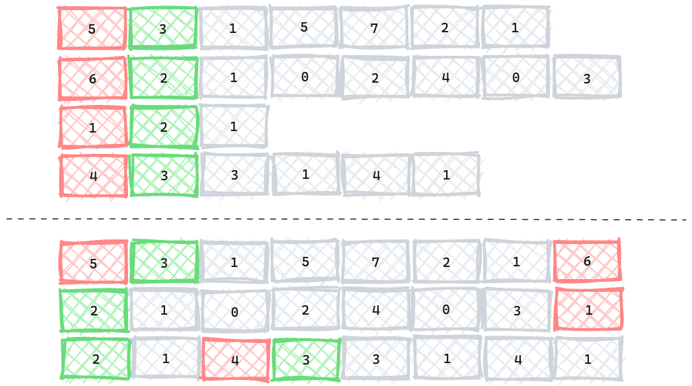
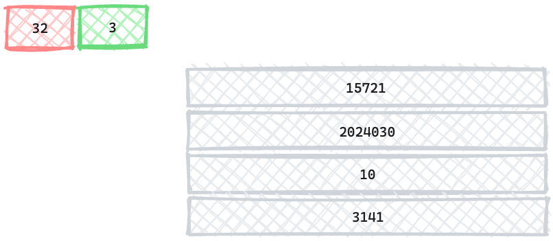

Decimal is a standard SQL data type for storing exact numeric values, e.g., monetary values. That means it cannot be stored in [IEEE 754](https://en.wikipedia.org/wiki/IEEE_754) format, which may lose precision. This post introduces the logical definition of the `DECIMAL` data type in SQL and discusses its various physical layouts.

## Logical Definition

The definition of the `DECIMAL` data type in [SQL92](https://www.contrib.andrew.cmu.edu/~shadow/sql/sql1992.txt) (where it is called "exact numeric") can be summarized as follows. A decimal value $d$ has a **precision** $p$ and a **scale** $s$.

- $p$ is a positive integer that determines the number of significant digits in the value. That is, $d$ can have at most $p$ digits.
- For a scale of $s$, the exact numeric value is $d \times 10^{-s}$. In other words, $s$ is the number of digits to the right of the decimal point.

For example, a decimal data type of precision 5 and scale 2, denoted as `DECIMAL(5, 2)`, can store values from -999.99 to 999.99, inclusive.

Different systems may have slightly different definitions. For example, PostgreSQL 15 support a [negative scale](https://www.postgresql.org/docs/current/datatype-numeric.html#DATATYPE-NUMERIC-DECIMAL), thus `DECIMAL(2, -3)` can store values between -99000 and 99000.

## Physical Layout

Internal representation and storage of decimal values can vary between systems. In general, there are two decisions to make:

- How to store the unscaled value $d$.
  1. Store $d$ as an **_fixed-size_ integer**, e.g., `int32`, `int64`.
  1. Store $d$ as a **_variable-size_ string of digits**. For example, `15721` is stored as `[0x1, 0x5, 0x7, 0x2, 0x1]`. This approach might be space-efficient for small values, but more complex to perform arithmetic operations.
- How to represent a batch of decimal values.
  1. Per-value encoding. Store the value and scale for each decimal value. Digit shrinking can be performed under this encoding. For example, `[8900, 0.005, 3.14]` can be stored as `[(89, -2), (5, 3), (314, 2)]`, where each unscaled value has as least significant digits as possible.
  1. Batch encoding. Store the scale once for the entire batch. This encoding enables faster in-batch arithmetic operations since each value has the same scale.

Usually, systems using string storage prefer the per-value encoding for better space efficiency. As the following diagram shows, each decimal value is stored as a tuple of precision (red, also the length of the string), scale (green), and unscaled value in string (gray). In this approach, each value can choose the minimum number of digits to represent itself.



On the other hand, systems aiming to computation performance prefer the integer storage and batch encoding. The following diagram is an simplified version of [Apache Arrow](https://arrow.apache.org/docs/format/Columnar.html) columnar format for decimal array. The percise and the scale are stored as the metadata of the array, and the unscaled values are stored as a contiguous array of integers. This encoding is optimized for SIMD and vectorization (discussed later).



In the following sub-sections, several systems' implementations are presented. MySQL and PostgreSQL use the "string + per-value" approach, while Apache Arrow uses the "integer + batch" approach.

### MySQL

```c
typedef int32 decimal_digit_t;
struct decimal_t {
int intg, /* the number of *decimal* digits (NOT number of decimal_digit_t's !) before the point */
    frac, /* the number of decimal digits after the point */
    len; /* the length of buf (length of allocated space) in decimal_digit_t's, not in bytes */
bool sign; /* false means positive, true means negative */
decimal_digit_t *buf; /* an array of decimal_digit_t's */
};
```

### PostgreSQL

```c
#define DECSIZE 30

typedef unsigned char NumericDigit;
typedef struct
{
int ndigits; /* number of digits in digits[] - can be 0! */
int weight; /* weight of first digit */
int rscale; /* result scale */
int dscale; /* display scale */
int sign; /* NUMERIC_POS, NUMERIC_NEG, or NUMERIC_NAN */
NumericDigit *buf; /* start of alloc'd space for digits[] */
NumericDigit *digits; /* decimal digits */
} numeric;

typedef struct
{
int ndigits; /* number of digits in digits[] - can be 0! */
int weight; /* weight of first digit */
int rscale; /* result scale */
int dscale; /* display scale */
int sign; /* NUMERIC_POS, NUMERIC_NEG, or NUMERIC_NAN */
NumericDigit digits[DECSIZE]; /* decimal digits */
} decimal;
```

### Apache Arrow

Apache Arrow includes a language-independent columnar memory format aiming for high-performance analytics. In particular,

- Data adjacency for sequential access
- $O(1)$ (constant-time) random access
- SIMD and vectorization-friendly

First, data is stored in contiguous memory, isolated from metadata, thus takes full use of CPU cache. That is to say, all bits fetched into the cache are useful for computation. Second, fixed-width data supports random access, i.e., access by index. By aligning data in memory (128, 256, or 512 bits base), Arrow can take advantage of SIMD instructions to perform operations on multiple values at once, without reordering or unpacking.

```rust
pub enum DataType {
    // ...
    Decimal128(u8, i8),
    Decimal256(u8, i8),
    // ...
}
impl ArrowPrimitiveType for Decimal128Type {
    type Native = i128;
}
impl ArrowPrimitiveType for Decimal256Type {
    type Native = i256;
}
```

## Conclusion

This post introduces the `DECIMAL` data type in SQL and discusses its various physical layouts. Systems aiming for space efficiency usually store a decimal value as a tuple of precision, scale, and variable-length digit string, while systems aiming for computation performance store a batch of decimal values as a fixed-size integer array with shared scale.
