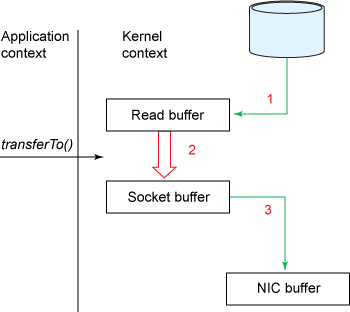

Zero-copy is a technique that reduces data copying between user space and kernel space. In Linux, zero-copy is implemented via the [sendfile(2)](https://man7.org/linux/man-pages/man2/sendfile.2.html) system call.

```c
#include <sys/sendfile.h>

ssize_t sendfile(int out_fd, int in_fd, off_t *_Nullable offset,
                size_t count);
```

`sendfile` transfers data between two file descriptors without copying it to and from user space (i.e., without using `read` and `write`). This makes it efficient for serving static resources, proxying network traffic, and similar use cases.




Starting with [Go 1.22](https://tip.golang.org/doc/go1.22#:~:text=copies%20from%20a%20File%20to%20a%20net.UnixConn), copies from a File to a net.UnixConn use the sendfile system call. The implementation can be found in [`src/os/zero_copy_linux.go`](https://cs.opensource.google/go/go/+/refs/tags/go1.24.2:src/os/zero_copy_linux.go). Generally, developers should use `io.Copy`, which attempts to use zero-copy system calls internally.

---

1. [Efficient data transfer through zero copy](https://developer.ibm.com/articles/j-zerocopy/) introduces zero-copy in Java.
1. [golang/go#58808](https://github.com/golang/go/issues/58808) is the proposal for general zero-copy support from os.File and TCPConn to UnixConn in Go.
1. [copy_file_range(2)](https://man7.org/linux/man-pages/man2/copy_file_range.2.html) and [splice(2)](https://man7.org/linux/man-pages/man2/splice.2.html) are additional Linux syscalls used for zero-copy.
